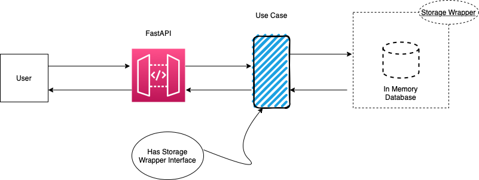

## Assignment

Write a simple application that provides movie suggestions for a user based on their movie genre preference. You can choose tools and libraries that you use yourself. Provide a REST API for this. We want to use multiple external services like Netflix or IMDB for the recommendations. Let's assume that you don't have access to those external services yet, don't know their exact API yet, but must implement something now and use the APIs later.  

## Table of Contents

*   [Tools Used](#tools-used)
*   [Running App](#running-app)
*   [Solution Architecture Overview](#solution-architecture-overview)
*   [Endpoints](#endpoints)
*   [Testability ](#testability)
*   [Implementing External Services](#implementing-external-services)
*   [Consideration for future persistence](#consideration-for-future-persistence)
*   [Microservice consideration](#microservice-consideration)

## Tools Used

1. [FastAPI](https://fastapi.tiangolo.com)
2. Docker

## Running app

1. Clone the repo
2. Run `docker-compose build` 
2. Run `docker-compose up` 
3. After the app is up and running the API documentation can be accessed from `http://localhost/docs`


## Solution Architecture Overview



The app structure looks like 

```
- app (FastAPI)
- movie 
    - domain 
    - repository
    - use_cases
- tests
```

The *movie directory* includes standard layers of:

1. directory domain: entities (the class Movie), 
2. directory use cases: (movie_list_use_case and movie_recommended_use_case),
3. directory repository: gateways and external systems ((the class MemRepo)

The *test directory* includes: tests for all the entities, use cases , repository and rest api.

The *app directory* is the rest api.

While developing the app, separation of concerns between different components is taken into consideration. The components such as web framework such as FastAPI, use case (which implements business logic, in our case movie recommendation) and storage component are separated. Each component has different responsibilities and domains separated.

Objects in the dataset (movies) are described by some attributes and the recommendation engine shall allow the user to select the genre and provide the list of recommended movies. The system exposes a REST API and works with in-memory storage system. I tried to create a system in which the user interface (web framework) and the data source (in memory, text files, relational database) are details of the implementation, and not core parts of it.


When implementing a microservice exposing an API, we need to avoid tight coupling between the different components that make up the application. 

In order to avoid strong coupling between use case and storage component inversion of control technique is implemented. Inversion of control happens in two phases: 

1. In the first phase the use case needs to extract genre specific recommended movies,so the database wrapper needs to provide a single entry point that we might call `recommended_list`.

2. In the second phase of inversion of control the caller (the use case) is modified to avoid hard coding the call to the specific implementation.The use case accepts an incoming object as a parameter of its constructor, and receives a concrete instance of the adapter at creation time. So we will assume the object we pass implements the required methods. 

## Endpoints

1. GET `http://localhost/api/v1/movies` - will return the list of movies
2. GET `http://localhost/api/v1/movies/{genre}` - will recommend movies based on user preference, endpoint could be `http://localhost/api/v1/movies/Thriller`

## Testability 

The advantage with this architecture is testability. When we clearly separate components we clearly establish the data each of them has to receive and produce, so we can ideally disconnect a single component and test it in isolation.


## Implementing External Services
For implementing external services like Netflix we could write a new use case which will accesses external services. 


## Consideration for future persistence

I have implemented repository pattern that helps to decouple the data layer from the business layer by adding an abstraction layer which exposes an in-memory list interface of the data. Regardless of the database engine that we use, the business layer (use case) will always receive the same objects from the repository.From the application’s perspective, if the database is moved from a in-memory database to a SQL database or any other kind of database, the conversation across the API should not change. Additional adapters for the same port thus include an SQL adapter, a flat file adapter, and most importantly, an adapter to a “mock” database, one that sits in memory and doesn’t depend on the presence of the real database at all.

## Microservice consideration

1. Develop micro-service based on well defined scope, or task or domain (applying single responsibility principle). For example, *Movie Recommendation micro-service* will only recommend movie. The service will have movie recommendation app (with business use case) and recommendation api that will expose the service. Another microservice (for instance, *User micro-service*) which needs to interact with *Movie Recommendation micro-service* will do with API calls.

2. Implement hexagonal architecture, software architectural pattern that encourages us to decouple the business layer from the implementation details of the database and the application interface.

 

